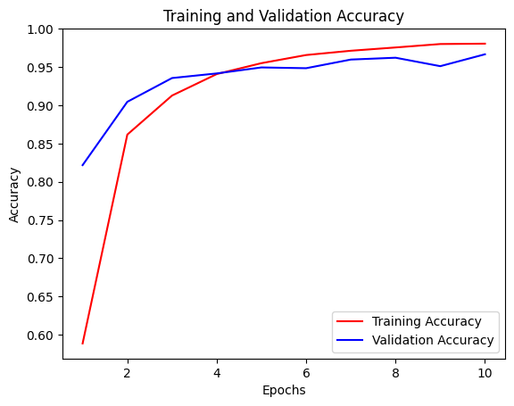
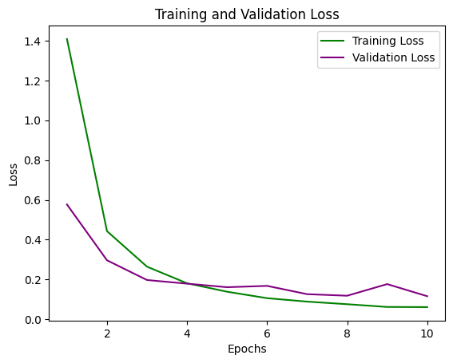
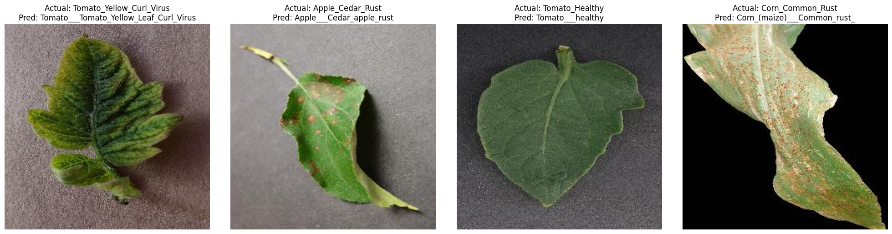

# Plant Disease Prediction using Deep Learning (CNN) & Keras

[Access the Deployed Model on the Web🍅](https://plant-disease-prediction-using-deep-learning-cnn-and-keras.streamlit.app/)

<p>

</p>


A comprehensive deep learning project to classify plant diseases from leaf images using Convolutional Neural Networks (CNN) with TensorFlow and Keras. This repository includes the complete pipeline from data preprocessing and model training to deployment using a Streamlit web application.

## 📌 Project Overview

Plant diseases pose a significant threat to global food security. Early detection is crucial for effective treatment and crop management. This project leverages computer vision and deep learning to automate the detection of plant diseases.

## 🛠️ Tech Stack

* **Deep Learning Framework:** TensorFlow, Keras
* **Language:** Python
* **Data/Image Processing:** NumPy, Pandas, OpenCV
* **Visualization:** Matplotlib, Seaborn
* **Web Framework:** Streamlit
* **Development Environment:** Jupyter Notebook, VS Code

**Key Features:**
* **CNN Model:** Built using TensorFlow/Keras.
* **Web Interface:** A user-friendly Streamlit app for real-time predictions on uploaded images.
* **Visualization:** Includes accuracy and loss curves, confusion matrices and plant health condition prediction results.

## 📂 Dataset

The model is trained on the **[New Plant Diseases Dataset](https://www.kaggle.com/datasets/vipoooool/new-plant-diseases-dataset) (available on Kaggle)**.
* **Total Classes:** 38 (Disease categories + Healthy plants)
* **Total Images:** 87,000+ RGB images.
* **Crop Types:** Apple, Blueberry, Cherry, Corn, Grape, Orange, Peach, Pepper, Potato, Raspberry, Soybean, Squash, Strawberry, Tomato.

## 📁 Repository Structure
<pre>
├── .vscode
│   ├── settings.json       # IDE settings
├── model_results_images
│   ├── accuracy_results.png       # accuracy curves
│   ├── confusion_matrix.png       # confusion matrix
│   ├── loss_results.png       # loss curves
│   ├── prediction_results.png        # model prediction images
├── model_test_notebook
│   ├── plant_disease_model_test.ipynb        # jupyter notebook for testing model
├── model_training_notebook
│   ├── plant_disease_detection.ipynb        # jupyter notebook for developing and training model
├── streamlit_app
│   ├── plant_disease_prediction_app.py        # script for deploying model using Streamlit
├── test_images        # images for testing model
├── trained_model
│   ├── plant_disease_trained_model.keras        # model in '.keras' format
├── training_history
│   ├── plant_disease_training_history.json        # model training history
├── .gitignore
├── LICENSE
├── README.md
├── intro_image.jpg        # for homepage
└── requirements.txt       # project specific dependencies
</pre>

## 🚀 Getting Started

Follow these steps to set up the project locally.

### Prerequisites
Ensure you have **Python 3.8+** installed.

### 1. Clone the Repository
```bash
git clone https://github.com/Oluwatobi-coder/plant-disease-prediction-using-deep-learning-cnn-and-keras.git
cd plant-disease-prediction-using-deep-learning-cnn-and-keras
```

### 2. Install Dependencies
```bash
pip install -r requirements.txt
```

## 🧠 Model Training
If you want to retrain the model or experiment with the architecture:

1. Navigate to the `model_training_notebook/` directory.

2. Open the training notebook (e.g., via VS Code or any other IDE of choice).

3. Run the cells to train the model. The trained model will be saved to the `trained_model/` directory.

## 🌐 Running the Streamlit App
To interact with the model using the web interface locally:

1. Navigate to the `streamlit_app` directory:
```bash
cd streamlit_app
```
2. Run the Streamlit command:
```bash
streamlit run streamlit_app/plant_disease_prediction_app.py
```
3. Upload a plant leaf image to get the disease prediction and confidence score.

## 📊 Results

* **Accuracy and Loss Curves:** visualized in the `plant_disease_detection.ipynb` notebook in the `model_training_notebook` directory and saved in `model_results_images` folder.

  <p align="center">
  
  
</p>

* **Sample Results:** visualized in the `plant_disease_model_test.ipynb` notebook in the `model_test_notebook` directory and saved in `model_results_images` folder.
  <p align="center">
  
</p>

## 🤝 Contributing

Contributions are welcome! If you have suggestions for improving the model accuracy or the web interface:

* Fork the repository.

* Create a new branch (`git checkout -b feature-branch`).

* Commit your changes.

* Push to the branch and open a Pull Request.

## 📜 License

This project is licensed under the MIT License - see the `LICENSE file` for details.

## 
If you find this research or implementation helpful in your own work, feel free to ⭐ the repository to help others find it.
